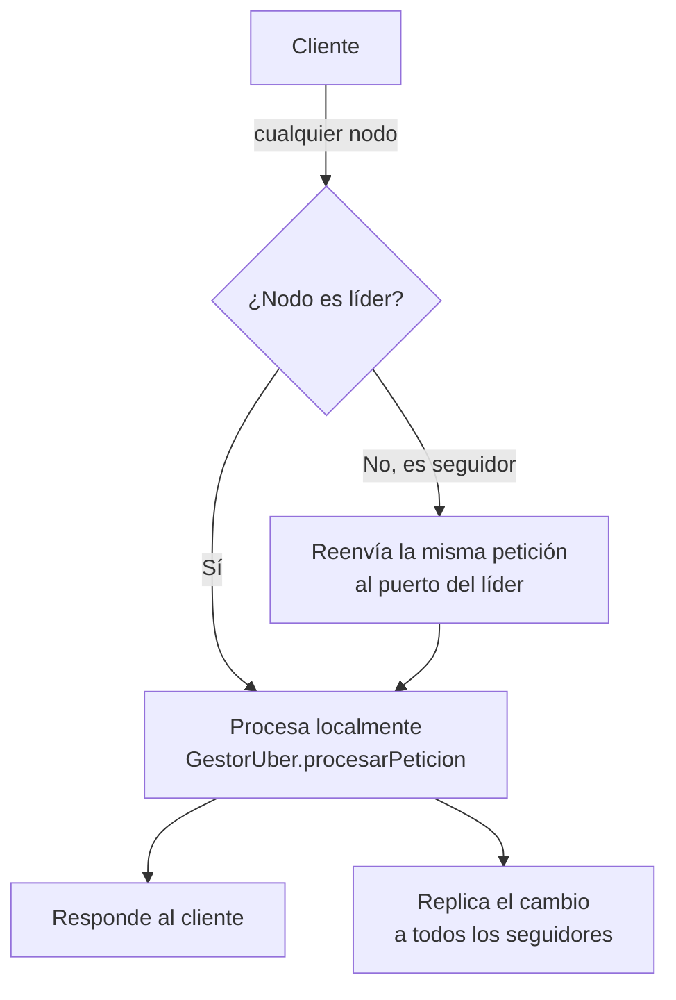
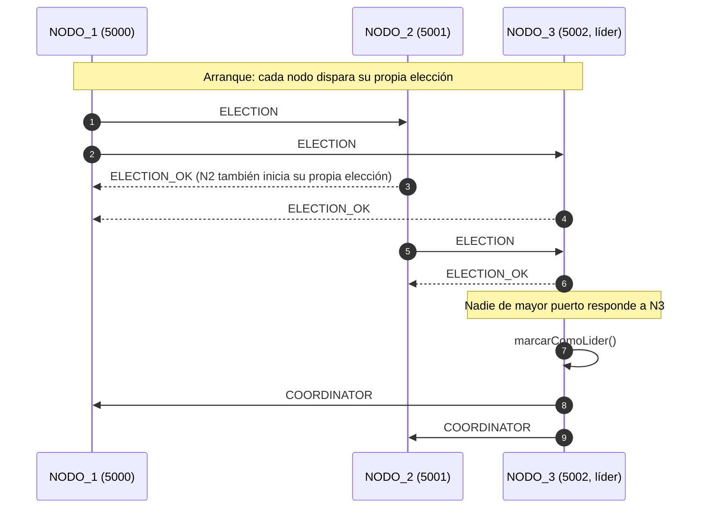

# Coordinación Distribuida: Elección de Líder (Bully) y Replicación de Estado

## 1. Problema que resuelve

En la versión del Parcial, cada nodo (`NodoUber`) levantaba su propio `GestorUber` con
estado en memoria **totalmente aislado** (`viajes`, `conductoresDisponibles`). Los
heartbeats entre nodos solo intercambiaban `PING`/`PONG`, sin replicar datos. En la
práctica esto significaba que un viaje solicitado en NODO_1 era invisible para NODO_2 o
NODO_3: el sistema funcionaba como **tres aplicaciones Uber independientes** con
failover de cliente, no como un sistema distribuido coherente.

Para el Proyecto Final esto es un problema doble:

- Rompe la **transparencia de ubicación** que el informe ya afirmaba tener.
- No cumple el requisito obligatorio de la **Sección 2.3** (al menos un algoritmo de
  exclusión mutua o elección de coordinador).

## 2. Diseño general

Se eligió **elección de coordinador con el algoritmo Bully** (abusón). La idea central:
el **nodo líder es el único que asigna conductores** (el recurso crítico compartido real
del dominio Uber). Los nodos seguidores nunca mutan su copia de los viajes por cuenta
propia: reenvían la escritura al líder de forma transparente y el líder, tras procesarla,
**replica** el resultado a los demás. Esto resuelve a la vez el problema de estado
aislado y le da un propósito real al algoritmo de coordinación exigido por la rúbrica.



## 3. Identidad y criterio de elección

Se usa el **puerto del nodo como ID numérico** de Bully: gana la elección el nodo
*vivo* con el puerto más alto. Con la topología actual (`NodoUber.RedConfig.NODOS_VECINOS`:
NODO_1=5000, NODO_2=5001, NODO_3=5002), NODO_3 es el líder natural mientras esté arriba.

## 4. Protocolo de mensajes

Se agregaron 4 tipos de mensaje a `TipoMensaje` (`src/uber/shared/TipoMensaje.java`):

| Mensaje | Quién lo envía | Propósito |
|---|---|---|
| `ELECTION` | Nodo que inicia la elección | Notifica a los nodos de puerto mayor |
| `ELECTION_OK` | Nodo de puerto mayor que está vivo | "Yo sigo en pie, no te declares líder" |
| `COORDINATOR` | Nodo que se autoproclama líder | Anuncia el nuevo liderazgo a todos |
| `REPLICAR_ESTADO` | El líder, tras cada mutación | Propaga el `Viaje` afectado + la lista de conductores |

Las clases `InfoNodo` (id + puerto) y `ReplicaEstado` (`Viaje` + lista de conductores)
son los *payloads* serializados (marshalling con `ObjectOutputStream`, igual que el resto
del sistema) de `COORDINATOR`/`ELECTION` y de `REPLICAR_ESTADO` respectivamente.



Implementación: `Coordinador.iniciarEleccion()` envía `ELECTION` (vía socket TCP corto,
mismo patrón que el heartbeat existente) solo a los vecinos con puerto mayor. Si **ninguno**
responde `ELECTION_OK`, el nodo se autoproclama líder (`GestorUber.marcarComoLider()`) y
hace `broadcastCoordinador()`. Si alguno respondió OK, el nodo espera pasivamente el
`COORDINATOR` (llega por el listener normal de conexiones entrantes) con un *watchdog* de
4 segundos que reintenta la elección si nunca llega — cubre el caso de que el nodo
superior también caiga a mitad de la elección.

## 5. Cuándo se dispara una elección

1. **Al arrancar el nodo**, tras el primer barrido completo de heartbeats
   (`NodoUber.conectarConVecinos`, variable `primeraRonda`).
2. **Cuando el heartbeat detecta inalcanzable justamente al líder actual**
   (`NodoUber.conectarConVecinos`, comparación `vecinoId.equals(gestor.obtenerLiderId())`
   dentro del `catch` del heartbeat). Esto cumple textualmente el requisito de la
   rúbrica: *"que se dispare solo cuando se detecta que el coordinador actual cayó"*.

## 6. Reenvío transparente de escrituras (transparencia de acceso/ubicación)

`ManejadorCliente` clasifica las acciones en lectura (`CONSULTAR_VIAJES`, se responde
localmente en cualquier nodo) y escritura (`SOLICITAR_VIAJE`, `PROGRAMAR_VIAJE`,
`FINALIZAR_VIAJE`). Si la petición de escritura llega a un nodo que **no** es el líder,
`Coordinador.reenviarALider(...)` abre una conexión nueva hacia el líder, reenvía el
**mismo `MensajeUber`** (mismo `requestId`, por lo que la caché de idempotencia del líder
sigue funcionando) y retransmite la respuesta real al cliente original.

El cliente (`ClienteUber`) **no cambió**: no sabe ni necesita saber quién es el líder en
cada momento — pidió el viaje al puerto 5000 y obtuvo respuesta, aunque quien lo procesó
haya sido NODO_3. Esta es la evidencia concreta de transparencia de ubicación para el
informe.

Si el líder no responde durante el reenvío (caído justo en ese instante), el nodo
devuelve `TipoMensaje.ERROR` ("Coordinador no disponible...") y dispara su propia
elección en segundo plano para recuperarse cuanto antes.

## 7. Replicación de estado (líder → seguidores)

`GestorUber` expone un *hook* `setListenerReplicacion(Consumer<Viaje>)` invocado al
final de **toda** mutación de estado (`solicitarViaje`, `programarViaje`,
`ejecutarViajeProgramado`, `finalizarViaje`, `finalizarViajeAutomatico`). `NodoUber`
conecta ese hook así:

```java
gestor.setListenerReplicacion(viaje -> {
    if (gestor.esLider()) {
        List<String> snapshot = gestor.obtenerSnapshotConductores();
        new Thread(() -> coordinador.replicarEstado(viaje, snapshot)).start();
    }
});
```

`Coordinador.replicarEstado(...)` envía `REPLICAR_ESTADO` (best-effort, sin esperar
respuesta) a cada seguidor, que aplica el cambio con `GestorUber.aplicarReplicacion(...)`.
Por eso las lecturas (`CONSULTAR_VIAJES`) funcionan correctamente **en cualquier nodo**,
incluso si el viaje fue creado a través de otro.

Punto importante: al convertirse en líder, el nodo recalibra su generador de IDs
(`GestorUber.recalibrarGeneradorId()`, al máximo ID visto en su copia de viajes + 1) para
no pisar viajes ya creados por el líder anterior tras una reelección.

## 8. Relojes de Lamport en los mensajes de coordinación

Todos los mensajes de elección, anuncio de liderazgo y replicación llevan también el
campo `relojLogico` y respetan las reglas LC1/LC2 ya usadas en el resto del sistema
(`GestorUber.obtenerEIncrementarReloj()` / `sincronizarReloj(...)`). Esto deja registrado
en los logs el orden causal de los eventos de coordinación, no solo de los viajes —
útil para el punto 4.1 del informe ("cada evento relevante queda registrado con su marca
lógica").

## 9. Métrica de mensajes de coordinación

`GestorUber` mantiene un contador (`AtomicInteger contadorMensajesCoordinacion`)
incrementado en cada envío de `ELECTION`, `ELECTION_OK` y `COORDINATOR`
(`incrementarContadorCoordinacion()` / `obtenerContadorCoordinacion()`). Queda listo para
que el generador de carga (próxima etapa) lo reporte en la tabla de métricas de la
Sección 3 de la rúbrica ("cantidad de mensajes que genera el algoritmo de coordinación").

## 10. Limitación conocida (para declarar honestamente en el informe)

Si el líder cae con un **viaje programado pendiente**, el `ScheduledExecutorService` que
lo dispararía es local a ese nodo y no se replica como tarea — solo se replica el objeto
`Viaje` con estado `PROGRAMADO`. El nuevo líder no retoma automáticamente ese temporizador.
Se documenta como trabajo futuro (scheduler distribuido), no se resolvió en esta etapa
para no sobre-diseñar un mecanismo fuera del alcance del curso.

## 11. Evidencia real de funcionamiento (logs de la verificación)

Se levantaron los 3 nodos como procesos Java independientes y se probó end-to-end:

**a) Elección al arrancar** — NODO_3 (puerto más alto) se autoproclama líder y los demás
lo reconocen:

```
[NODO_3] [BULLY] NODO_3 inicia una elección...
[NODO_3] [BULLY] NODO_3 se autoproclama LÍDER (puerto 5002).
[NODO_1] [BULLY] Nuevo líder reconocido: NODO_3 (puerto 5002).
[NODO_2] [BULLY] Nuevo líder reconocido: NODO_3 (puerto 5002).
```

**b) Escritura reenviada desde un seguidor** — se solicitó un viaje contra NODO_1
(puerto 5000, seguidor); NODO_1 lo reenvía y NODO_3 (líder) lo procesa:

```
[NODO_1] [LC: 200] [HILO 19] Petición: SOLICITAR_VIAJE de TestUser
[NODO_3] [LC: 198] [HILO 22] Petición: SOLICITAR_VIAJE de TestUser
[NODO_3] [LC: 201] [GESTOR] Viaje iniciado: Viaje #1 | Pasajero=TestUser |
         Conductor=Conductor_Juan | Estado=EN_CURSO | Origen=Casa | Destino=Oficina
```

Resultado en el cliente (conectado a NODO_1, sin saber que lo atendió NODO_3):

```
✅ [UBER]: Viaje #1 | Pasajero=TestUser | Conductor=Conductor_Juan | Estado=EN_CURSO
```

**c) Replicación verificada en un tercer nodo** — NODO_2 (que no participó en la
petición) recibe el cambio:

```
[NODO_2] [LC: 156] [REPLICACIÓN] Estado actualizado desde NODO_3:
         Viaje #1 | Pasajero=TestUser | Conductor=Conductor_Juan | Estado=EN_CURSO
```

**d) Consistencia tras falla** — se mató el proceso de NODO_1; el cliente hizo failover
automático a NODO_2 y **encontró el mismo viaje** (antes de este cambio, esto fallaba):

```
⚠️ [RED] Nodo en puerto 5000 no responde. Buscando otro nodo activo...
   [RED] ACK recibido del puerto 5001: Procesando solicitud...
✅ [UBER]: [Viaje #1 | Pasajero=TestUser | Conductor=Conductor_Juan | Estado=EN_CURSO]
```

**e) Reelección tras caída del líder** — se mató el proceso de NODO_3 (líder); NODO_2
se autoproclama líder automáticamente:

```
[NODO_2] [BULLY] NODO_2 se autoproclama LÍDER (puerto 5001).
[NODO_2] [ALERTA] No hay respuesta de NODO_1 en el puerto 5000. Nodo inalcanzable.
[NODO_2] [ALERTA] No hay respuesta de NODO_3 en el puerto 5002. Nodo inalcanzable.
```

**f) Sin colisión de IDs tras la reelección** — un nuevo viaje pedido contra el nuevo
líder obtiene el ID #2 (no repite el #1 ya existente), gracias a
`recalibrarGeneradorId()`:

```
✅ [UBER]: Viaje #2 | Pasajero=OtroUser | Conductor=Conductor_Maria | Estado=EN_CURSO
```

## 12. Archivos modificados o creados

- `src/uber/shared/TipoMensaje.java` — nuevos tipos `ELECTION`, `ELECTION_OK`,
  `COORDINATOR`, `REPLICAR_ESTADO`.
- `src/uber/shared/InfoNodo.java` *(nuevo)* — payload `{id, puerto}` para anuncios de
  elección/liderazgo.
- `src/uber/shared/ReplicaEstado.java` *(nuevo)* — payload `{Viaje, conductoresDisponibles}`
  para la replicación.
- `src/uber/server/GestorUber.java` — estado de liderazgo, contador de mensajes de
  coordinación, replicación de estado, recalibración de IDs.
- `src/uber/server/Coordinador.java` *(nuevo)* — implementación del algoritmo Bully,
  broadcast de liderazgo, replicación y reenvío transparente al líder.
- `src/uber/server/ManejadorCliente.java` — ruteo de los nuevos tipos de mensaje y lógica
  de reenvío de escrituras cuando el nodo no es líder.
- `src/uber/server/NodoUber.java` — construcción del `Coordinador`, disparo de elección
  inicial y disparo de reelección cuando el heartbeat detecta caído al líder.

## 13. Mapeo a la rúbrica del Proyecto Final

| Punto de la rúbrica | Cómo lo cubre esta implementación |
|---|---|
| **2.3 / 4.5** — Algoritmo de coordinación obligatorio (elección de coordinador) | Algoritmo Bully completo, disparado solo ante caída del líder, verificable en logs (sección 11). |
| **2.4 / 4.6** — Recuperación efectiva ("vuelve a elegir coordinador... sin que el servicio se detenga") | Reelección automática al caer el líder (sección 11.e); el servicio sigue respondiendo durante y después de la reelección. |
| **4.1** — Transparencia de acceso y ubicación, ligada a ejemplos de código | El cliente nunca conoce al líder; `ManejadorCliente.reenviarOResponderError` y `Coordinador.reenviarALider` son la evidencia técnica concreta. |
| **4.2** — Modelado de funciones (diagramas UML) | Diagramas de secuencia de elección y reenvío/replicación incluidos en este documento (secciones 2 y 4), listos para incorporar al informe. |
| **3.2** — Métricas de mensajes de coordinación | Contador `contadorMensajesCoordinacion` en `GestorUber`, listo para el generador de carga. |
