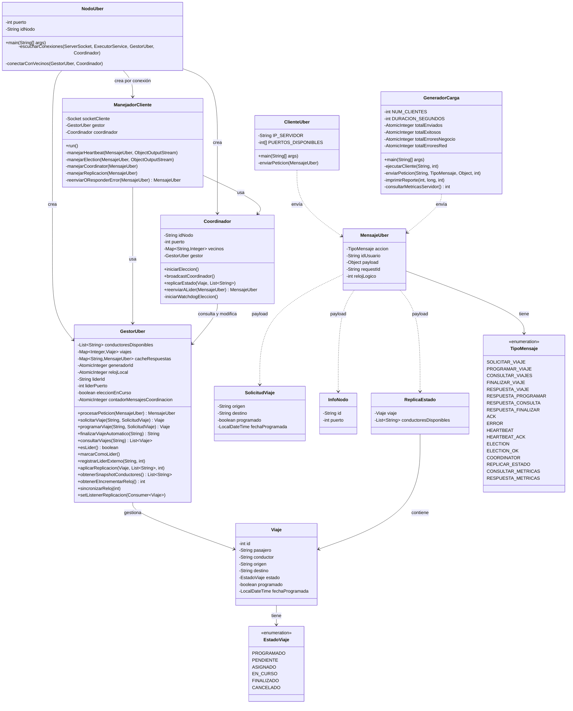
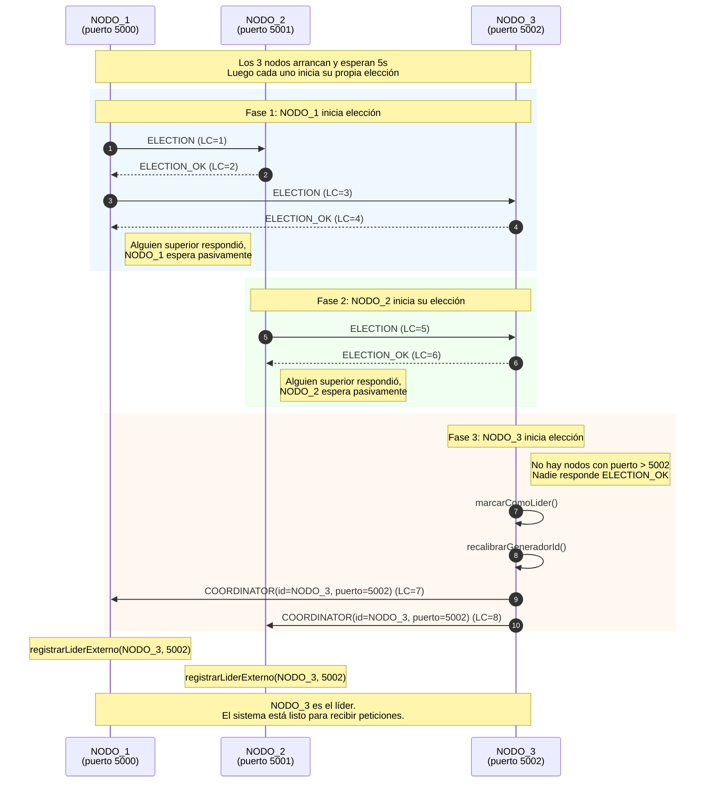
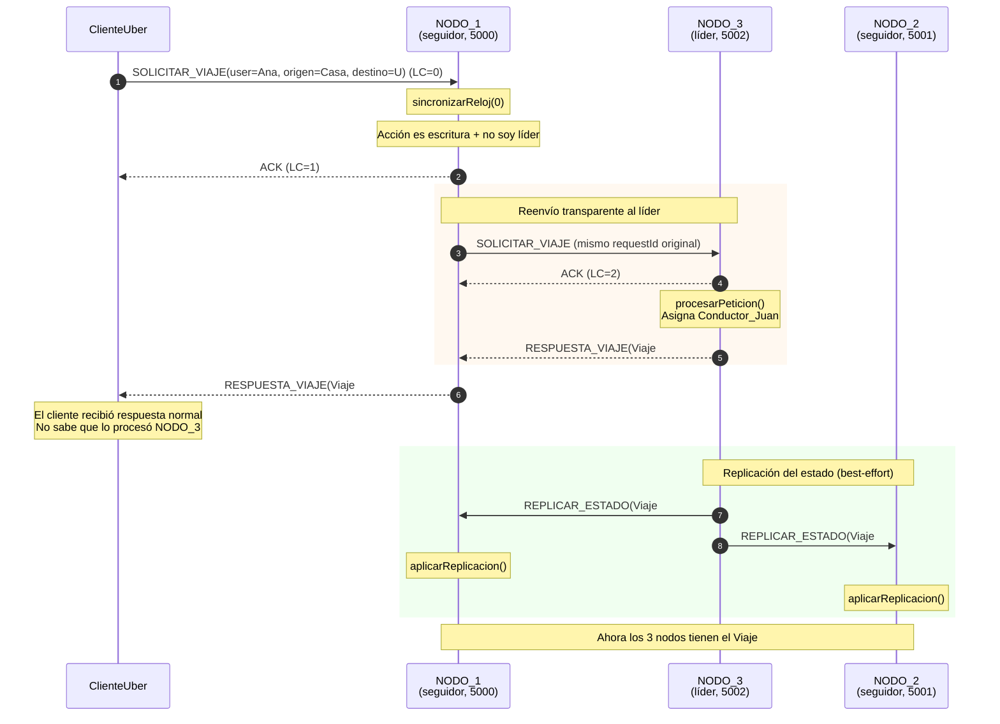
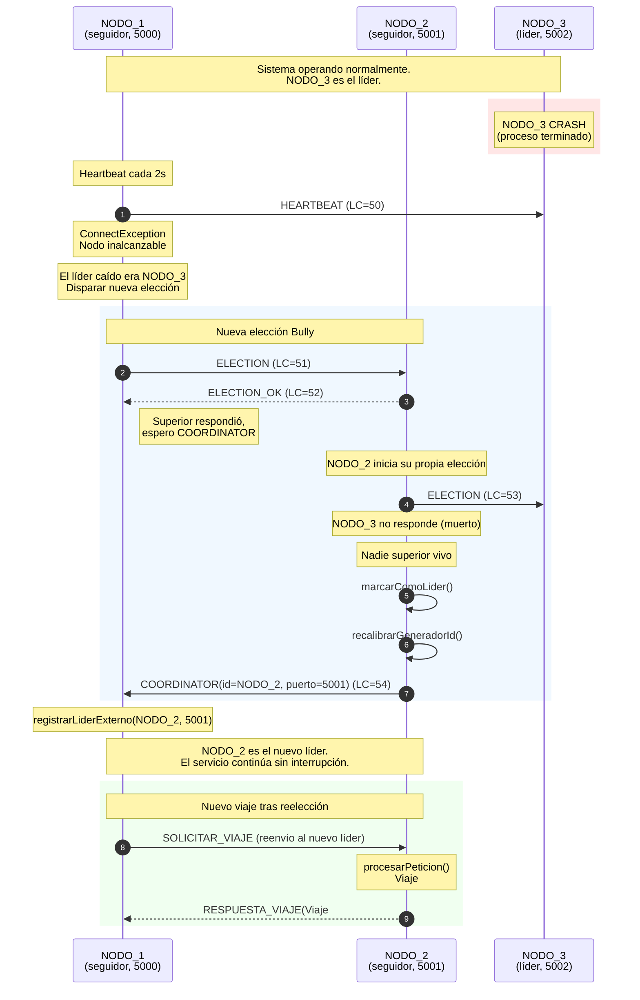
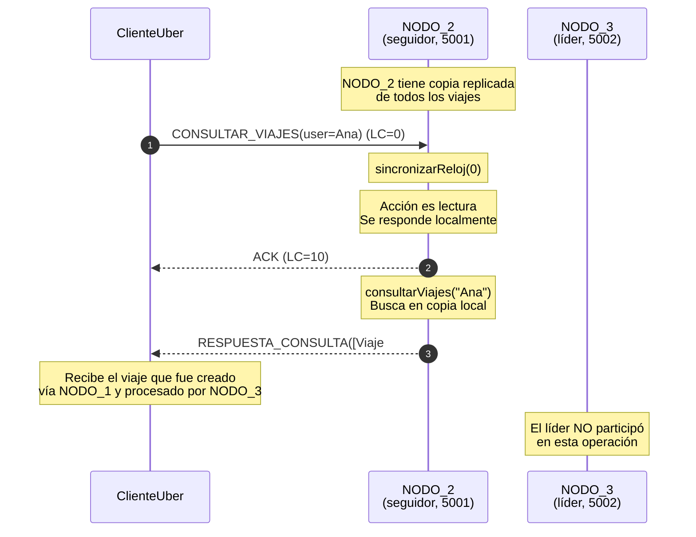
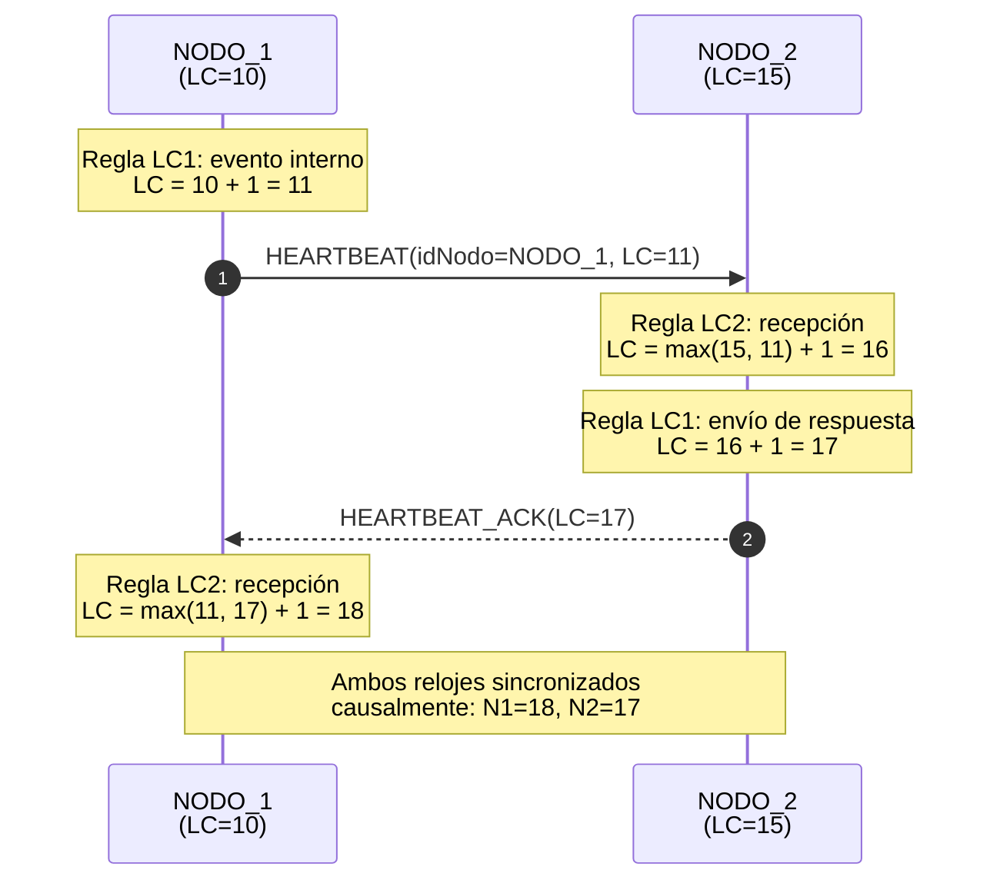
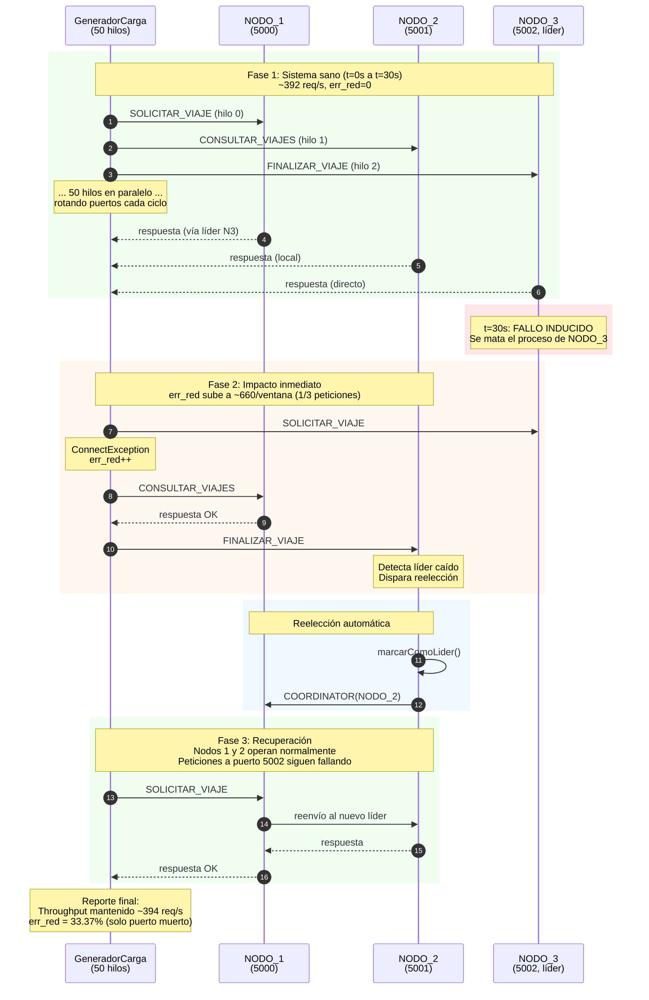
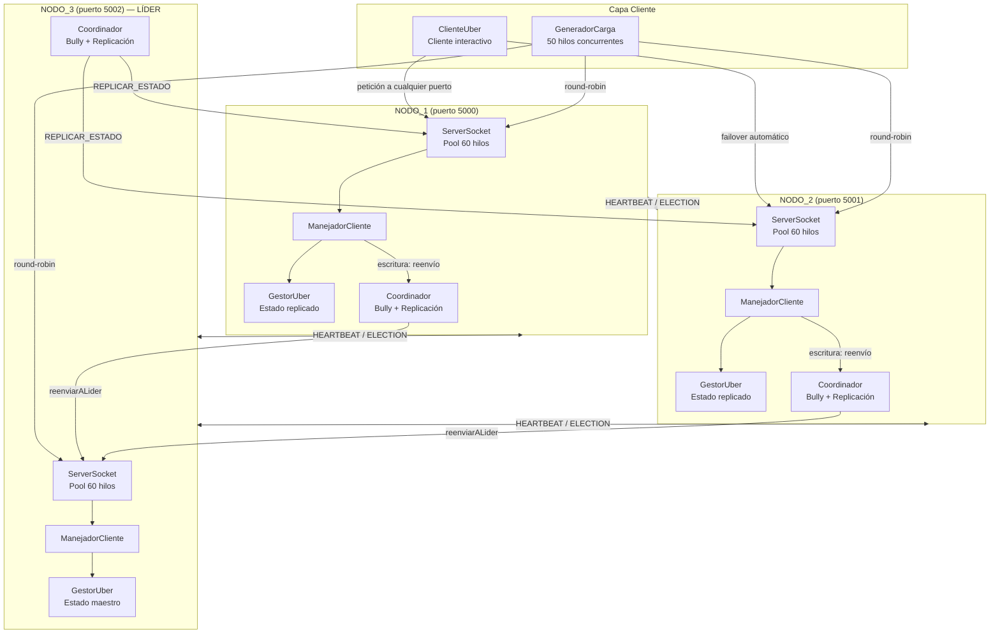
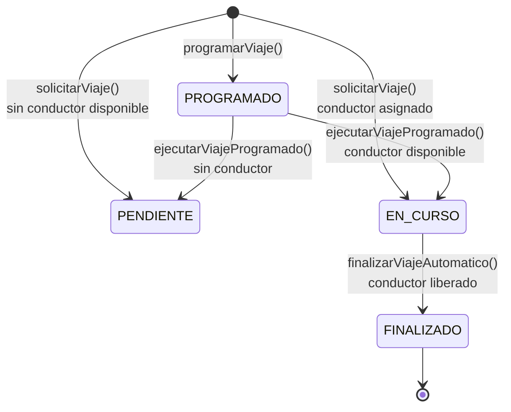

# Diagramas UML — Proyecto Final Uber Distribuido

Todos los diagramas están en formato Mermaid. Para renderizarlos pueden usar:
- El preview de Mermaid en VS Code (extensión "Markdown Preview Mermaid Support")
- https://mermaid.live (pegar el código y exportar como imagen)
- El propio editor de Google Docs/Word con plugins de Mermaid

---

## 1. Diagrama de Clases (Arquitectura General)

---

## 2. Secuencia: Elección de Líder (Bully) al Arrancar

---

## 3. Secuencia: Solicitar Viaje con Reenvío Transparente y Replicación

---

## 4. Secuencia: Caída del Líder y Reelección Automática

---

## 5. Secuencia: Consulta de Viajes (Lectura Local)

---

## 6. Secuencia: Heartbeat con Relojes de Lamport

---

## 7. Secuencia: Prueba de Carga con Fallo Inducido

---

## 8. Diagrama de Componentes (Arquitectura del Sistema)

---

## 9. Diagrama de Estados de un Viaje

---

## Notas para el informe

- Los valores de `LC` (Lamport Clock) en los diagramas son ilustrativos. En ejecución real los valores dependen del orden exacto de los eventos.
- El diagrama 7 (prueba de carga) es un resumen simplificado; en la realidad hay 50 hilos enviando simultáneamente.
- Para exportar los diagramas como imagen: pegar el código en https://mermaid.live y descargar como PNG o SVG.
