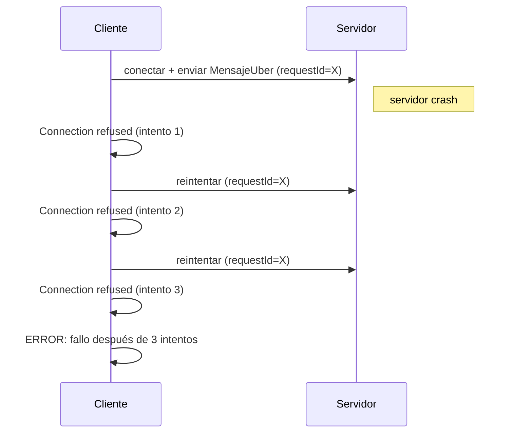
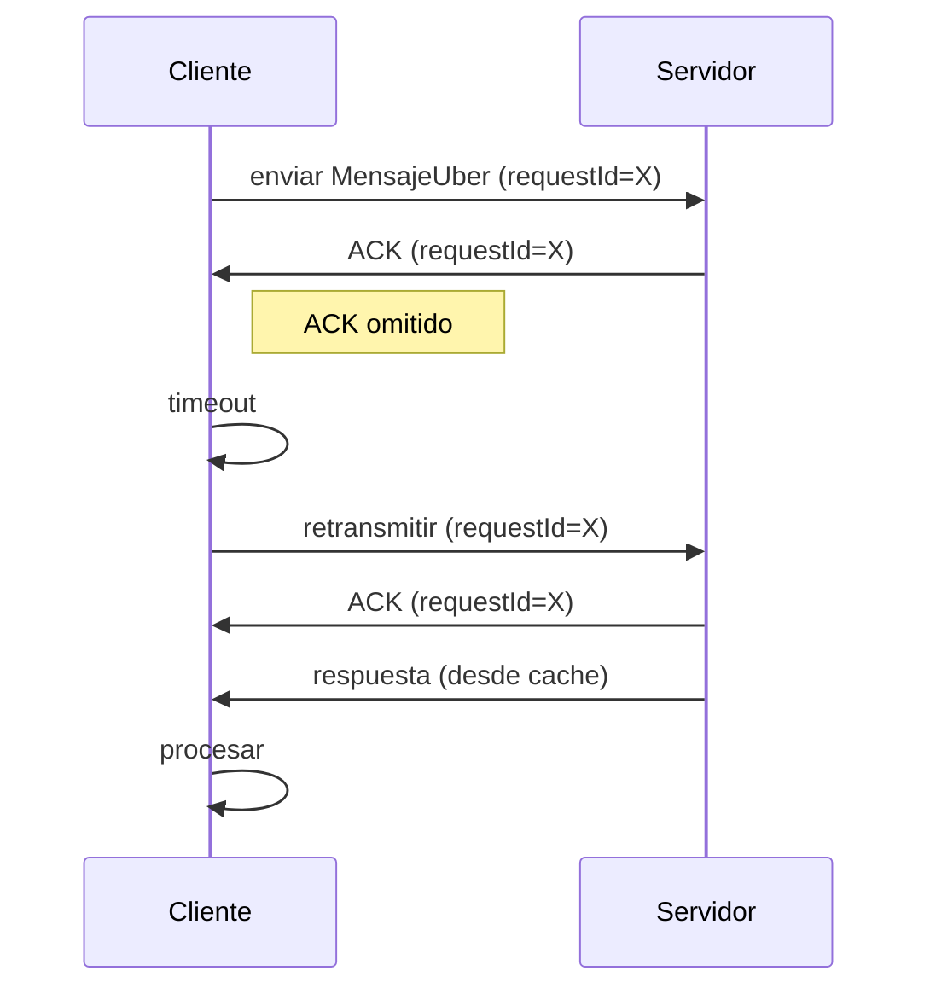

# Modelo de Fallos del Sistema Uber Distribuido

## Descripción General

Este documento detalla el modelo de fallos del sistema Uber distribuido, basado en el código actual con mejoras implementadas para tolerancia a fallos. Se clasifican los fallos esperados en dos tipos principales: Crash y Omisión, junto con las estrategias de detección y recuperación programadas. El sistema utiliza comunicación por sockets TCP, con ACKs, retransmisiones y cache para manejar fallos de manera robusta.

## Interacciones Clave del Sistema

### Flujo de Comunicación
- El cliente (`ClienteUber`) envía peticiones serializadas (`MensajeUber`) con un `requestId` único.
- El servidor (`ServidorUber`) acepta conexiones y delega a `ManejadorCliente`.
- El servidor envía un `ACK` inmediato para confirmar recepción.
- `GestorUber` procesa la petición, usa cache para evitar duplicados y mantiene estado en memoria.
- El cliente espera `ACK` y respuesta; reintenta en caso de timeout.

### Elementos Programados para Tolerancia
- **Timeout**: 5 segundos en sockets.
- **Reintentos**: Hasta 3 veces en el cliente.
- **ACKs**: Confirmaciones de recepción.
- **RequestId**: Identificadores únicos para rastreo.
- **Cache**: Almacena respuestas para retransmisiones.

## Clasificación de Fallos Esperados

### 1. Fallos de Crash
Un proceso deja de ejecutarse de manera inesperada, sin notificaciones previas. En el sistema:

- **Cliente Crash**:
  - El proceso cliente se detiene abruptamente durante una petición (e.g., excepción no manejada).
  - Impacto: Petición no enviada o respuesta no procesada.

- **Servidor Crash**:
  - `ServidorUber` o `ManejadorCliente` falla (e.g., excepción en `ObjectInputStream` o `GestorUber`).
  - Impacto: Conexiones no aceptadas, peticiones no procesadas.

- **Gestor Crash**:
  - `ScheduledExecutorService` en `GestorUber` falla, dejando viajes programados sin ejecutar.
  - Impacto: Viajes programados perdidos.

### 2. Fallos de Omisión
Un proceso falla en enviar o recibir mensajes, pero continúa ejecutándose. En el sistema:

- **Omisión de Petición**:
  - Mensaje del cliente se pierde en la red antes de llegar al servidor.
  - Impacto: Servidor no recibe nada, cliente timeout.

- **Omisión de ACK**:
  - Servidor envía `ACK`, pero se pierde.
  - Impacto: Cliente reintenta la petición completa.

- **Omisión de Respuesta**:
  - Servidor envía respuesta, pero se pierde después del `ACK`.
  - Impacto: Cliente reintenta con mismo `requestId`, servidor usa cache.

## Estrategias de Detección Programadas

### Detección de Fallos de Crash
- **Timeouts en Cliente**: Si no recibe `ACK` o respuesta en 5 segundos, detecta fallo y reintenta.
- **Reintentos con Conteo**: Cliente cuenta intentos (máx. 3); si falla, asume crash del servidor.
- **Logging en Servidor**: Excepciones en `ManejadorCliente` se registran en consola, indicando crash interno.
- **Monitoreo de Hilos**: Pool de hilos detecta tareas fallidas implícitamente al cerrar sockets.

### Detección de Fallos de Omisión
- **Espera de ACK**: Cliente espera `ACK` con `requestId` coincidente; timeout indica omisión.
- **Verificación de RequestId**: Servidor compara `requestId` en retransmisiones para detectar duplicados.
- **Timeout en Respuesta**: Después de `ACK`, cliente espera respuesta; timeout indica omisión.

## Estrategias de Recuperación Programadas

### Recuperación de Fallos de Crash
- **Reintentos Automáticos**: Cliente reintenta conexión y envío hasta 3 veces con mismo `requestId`.
- **Cache de Respuestas**: Servidor devuelve respuesta cacheada para retransmisiones, evitando reprocesamiento.
- **Cierre de Sockets**: Servidor cierra conexiones fallidas, liberando recursos.
- **Idempotencia**: Acciones como solicitar viaje no se duplican gracias a `requestId` y cache.

### Recuperación de Fallos de Omisión
- **Retransmisión de Peticiones**: Cliente reenvía petición completa si no recibe `ACK`.
- **ACK Inmediato**: Servidor confirma recepción antes de procesar, permitiendo al cliente detectar omisión temprana.
- **Cache para Respuestas Perdidas**: Retransmisiones usan cache para devolver respuestas sin efectos secundarios.
- **Manejo de Errores en Cliente**: Verifica `TipoMensaje.ERROR` antes de procesar payloads, evitando excepciones.

## Diagramas de Fallos

### Diagrama de Fallo por Crash

### Diagrama de Fallo por Omisión

## Mejoras Implementadas
- ACKs para confirmación.
- Retransmisiones con reintentos.
- RequestId para idempotencia.
- Cache de respuestas.
- Manejo de errores sin casts fallidos.

## Conclusión
El modelo refleja un sistema robusto con estrategias programadas para detectar y recuperar de fallos de Crash y Omisión. Las mejoras hacen el sistema más confiable, pero futuras adiciones como persistencia y replicación podrían mejorar aún más la tolerancia.