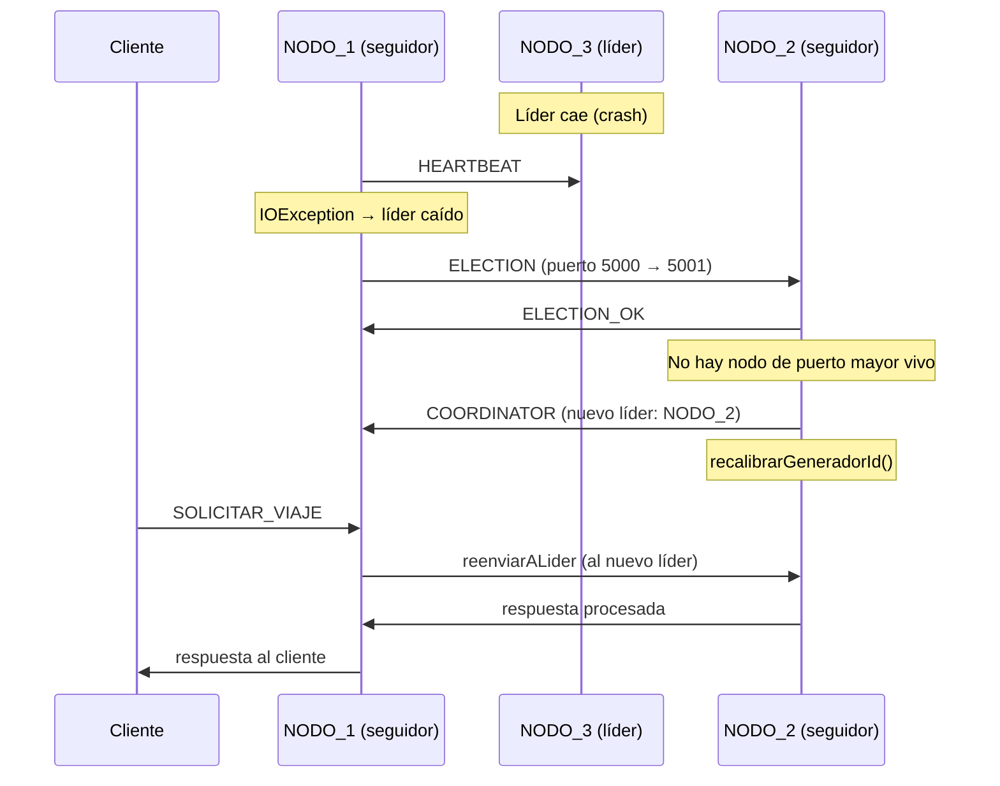
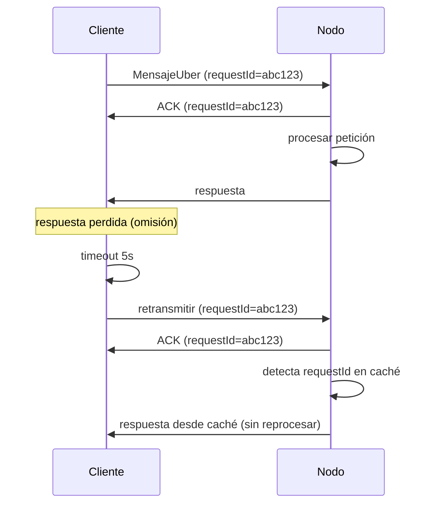
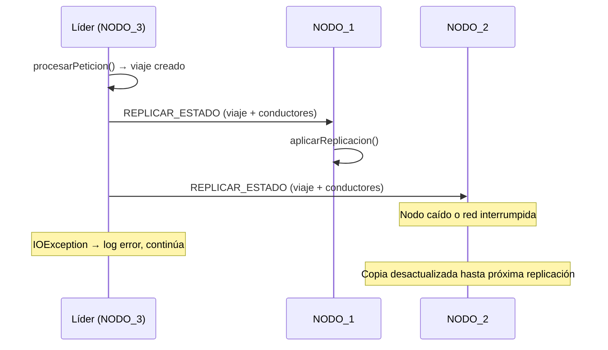

# Modelo de Fallos del Sistema Uber Distribuido

## Descripción General

El sistema Uber distribuido opera con tres nodos independientes (NODO_1:5000, NODO_2:5001, NODO_3:5002) coordinados mediante el algoritmo Bully. Un nodo líder centraliza las operaciones de escritura, mientras que los seguidores reenvían las escrituras al líder de forma transparente y responden lecturas desde su copia replicada. La comunicación entre todos los componentes es por sockets TCP con serialización Java (`ObjectOutputStream`/`ObjectInputStream`).

Este documento clasifica los fallos esperados, sus mecanismos de detección y las estrategias de recuperación programadas en el código.

## Interacciones del Sistema

### Canales de Comunicación

El sistema tiene cuatro tipos de canales TCP, cada uno con sus propios riesgos de fallo:

| Canal | Participantes | Propósito |
|---|---|---|
| Petición de negocio | Cliente → Nodo | Solicitar, consultar, programar, finalizar viajes |
| Heartbeat | Nodo → Nodo | Monitoreo de vida + sincronización de relojes Lamport |
| Elección Bully | Nodo → Nodo | Mensajes ELECTION, ELECTION_OK, COORDINATOR |
| Replicación | Líder → Seguidores | Propagación de estado (viaje + conductores disponibles) |

### Mecanismos de Tolerancia Existentes

- **Timeout en sockets**: 5 segundos en cliente, timeouts implícitos en conexiones inter-nodo.
- **Reintentos del cliente**: Hasta 3 intentos con el mismo `requestId`, rotando al siguiente puerto si falla.
- **ACKs**: Confirmación inmediata de recepción antes de procesar.
- **RequestId + caché de idempotencia**: El servidor almacena respuestas por `requestId` para que las retransmisiones no dupliquen operaciones.
- **Heartbeats**: Cada nodo envía HEARTBEAT a sus vecinos cada 2 segundos.
- **Reelección automática**: Si el heartbeat detecta que el líder cayó, dispara una nueva elección Bully.

## Clasificación de Fallos

### 1. Fallos de Crash

Un proceso deja de ejecutarse sin aviso previo.

#### Crash de un nodo seguidor

- **Impacto**: El líder no puede replicar el estado hacia ese nodo. Los clientes que se conecten a ese puerto reciben `Connection refused`.
- **Detección**: El heartbeat de los demás nodos detecta la ausencia en la siguiente ronda (máximo 2 segundos). Los clientes detectan el fallo por `IOException` al conectar.
- **Recuperación**: Los nodos restantes siguen operando normalmente. El líder intenta replicar hacia todos los vecinos pero ignora los que no responden (best-effort). El cliente rota al siguiente puerto disponible sin intervención del usuario.

#### Crash del nodo líder

- **Impacto**: Las escrituras que estaban siendo procesadas se pierden. Los seguidores que intentan reenviar peticiones al líder reciben `IOException`. Las replicaciones pendientes no se envían.
- **Detección**: El heartbeat de cada nodo sobreviviente detecta que el líder no responde. Al identificar que el nodo caído es el líder actual (`vecinoId.equals(gestor.obtenerLiderId())`), dispara `coordinador.iniciarEleccion()`.
- **Recuperación**:
  1. Se ejecuta el algoritmo Bully: cada nodo envía ELECTION a los nodos de puerto mayor.
  2. El nodo vivo con puerto más alto se autoproclama líder y envía COORDINATOR a los demás.
  3. El nuevo líder ejecuta `recalibrarGeneradorId()` para calcular el próximo ID de viaje a partir del máximo existente en su copia replicada, evitando colisiones.
  4. El servicio se reanuda en segundos sin intervención manual.

#### Crash del cliente

- **Impacto**: La petición en curso se pierde. Si el servidor ya procesó la petición y envió la respuesta, esta se descarta.
- **Detección**: El servidor detecta el cierre del socket al intentar escribir la respuesta (`IOException`).
- **Recuperación**: El servidor cierra la conexión y libera el hilo. No se requiere acción adicional. Si el cliente se reinicia y retransmite con el mismo `requestId`, la caché de idempotencia devuelve la respuesta original.

### 2. Fallos de Omisión

Un proceso sigue ejecutándose pero falla en enviar o recibir un mensaje.

#### Omisión de petición (cliente → nodo)

- **Impacto**: El nodo no recibe nada, el cliente espera indefinidamente hasta el timeout.
- **Detección**: Timeout de socket en el cliente (5 segundos sin ACK).
- **Recuperación**: El cliente retransmite la petición con el mismo `requestId`. Si el nodo original no responde tras 3 intentos, rota al siguiente puerto.

#### Omisión de ACK o respuesta (nodo → cliente)

- **Impacto**: El cliente no sabe si la petición fue procesada.
- **Detección**: Timeout en el cliente tras enviar la petición.
- **Recuperación**: El cliente retransmite con el mismo `requestId`. El servidor detecta el duplicado en la caché y devuelve la respuesta almacenada sin re-ejecutar la operación.

#### Omisión en reenvío al líder (seguidor → líder)

- **Impacto**: El seguidor no logra contactar al líder para reenviar una escritura.
- **Detección**: `IOException` o `ConnectException` en `Coordinador.reenviarALider()`.
- **Recuperación**: El seguidor devuelve un mensaje de ERROR al cliente. Si la causa es que el líder cayó, el siguiente heartbeat lo detecta y dispara una nueva elección. El cliente puede reintentar contra cualquier puerto.

#### Omisión en replicación (líder → seguidores)

- **Impacto**: Un seguidor no recibe la actualización de estado. Su copia queda temporalmente desactualizada.
- **Detección**: `IOException` al intentar conectar al seguidor en `Coordinador.replicarEstado()`.
- **Recuperación**: La replicación es best-effort (fire-and-forget). El líder registra el error en logs pero no reintenta. La próxima mutación exitosa enviará el estado completo actualizado. Esta inconsistencia temporal es una limitación documentada del sistema.

### 3. Fallos de Temporización

#### Elección Bully concurrente

- **Impacto**: Múltiples nodos pueden disparar elecciones simultáneamente al detectar la caída del líder.
- **Detección**: El algoritmo Bully maneja esto nativamente: cada nodo envía ELECTION solo a los de puerto mayor.
- **Recuperación**: Solo el nodo con el puerto más alto entre los vivos se autoproclama. Los demás reciben ELECTION_OK y esperan el COORDINATOR. Si el proclamado también cae antes de anunciar, el flag `eleccionEnCurso` tiene un timeout de 10 segundos tras el cual se reinicia la elección.

#### Viaje programado perdido por cambio de líder

- **Impacto**: Si el líder tenía un `ScheduledExecutorService` pendiente para ejecutar un viaje programado y ese líder cae, el nuevo líder hereda el `Viaje` con estado PROGRAMADO vía replicación pero no retoma el temporizador.
- **Recuperación**: No hay recuperación automática. Es una limitación conocida del sistema. El viaje queda en estado PROGRAMADO indefinidamente en el nuevo líder.

## Matriz de Fallos

| Tipo | Fallo | Detección | Tiempo detección | Recuperación | Automática |
|---|---|---|---|---|---|
| Crash | Seguidor cae | Heartbeat sin respuesta | ≤ 2s | Aislamiento, servicio continúa | Sí |
| Crash | Líder cae | Heartbeat sin respuesta | ≤ 2s | Reelección Bully + recalibración IDs | Sí |
| Crash | Cliente cae | IOException al escribir | Inmediata | Cierre de conexión + liberación de hilo | Sí |
| Omisión | Petición perdida | Timeout de socket (5s) | 5s | Retransmisión con mismo requestId | Sí |
| Omisión | ACK/Respuesta perdida | Timeout de socket (5s) | 5s | Retransmisión + caché idempotencia | Sí |
| Omisión | Reenvío al líder falla | IOException | Inmediata | Error al cliente + reelección si líder caído | Sí |
| Omisión | Replicación falla | IOException | Inmediata | Best-effort, se actualiza en próxima mutación | Parcial |
| Temporal | Elecciones concurrentes | Bully nativo | N/A | Gana el de puerto mayor | Sí |
| Temporal | Viaje programado perdido | No detectado | N/A | Sin recuperación automática | No |

## Diagramas de Fallos

### Crash del líder con reelección automática

### Omisión con retransmisión y caché de idempotencia

### Fallo de replicación (best-effort)

## Limitaciones Conocidas

1. **Replicación best-effort**: Si un seguidor pierde una replicación, su estado queda desactualizado hasta la siguiente mutación exitosa. No hay mecanismo de sincronización completa (full-sync) al reconectar un nodo.
2. **Viajes programados no se migran**: El temporizador del `ScheduledExecutorService` es local al líder. Si el líder cambia, los viajes PROGRAMADOS no se reactivan en el nuevo líder.
3. **Sin persistencia en disco**: Todo el estado vive en memoria. Si todos los nodos caen, se pierde todo.
4. **Split-brain teórico**: Si la red se particiona de forma que dos grupos no se ven entre sí, cada grupo podría elegir su propio líder. En la implementación actual (localhost) esto no ocurre, pero en una red real sería un riesgo.
