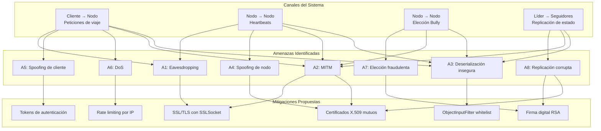

# Modelo de Seguridad del Sistema Uber Distribuido

## Descripción General

El sistema opera con tres nodos (NODO_1, NODO_2, NODO_3) coordinados por un líder electo mediante el algoritmo Bully. La comunicación se realiza por sockets TCP con serialización Java nativa. Existen cuatro tipos de canales: peticiones de negocio (cliente → nodo), heartbeats (nodo → nodo), mensajes de elección Bully (nodo → nodo) y replicación de estado (líder → seguidores). Todos transmiten datos en claro.

## Identificación de Canales Inseguros

### Canal 1: Cliente → Nodo (peticiones de negocio)

- **Protocolo**: Socket TCP plano, serialización con `ObjectOutputStream`.
- **Datos expuestos**: Nombre de usuario, origen y destino del viaje, fechas programadas, estados de viaje.
- **Riesgo**: Cualquier actor en la red local puede capturar las peticiones y leer información personal de los pasajeros.

### Canal 2: Nodo → Nodo (heartbeats)

- **Protocolo**: Socket TCP plano, objetos `MensajeUber` con tipo HEARTBEAT.
- **Datos expuestos**: Identificador del nodo, valor del reloj lógico de Lamport.
- **Riesgo**: Un atacante podría inyectar heartbeats falsos para simular que un nodo está vivo cuando no lo está, o manipular los valores del reloj lógico para desordenar la causalidad.

### Canal 3: Nodo → Nodo (elección Bully)

- **Protocolo**: Socket TCP plano, objetos `MensajeUber` con tipos ELECTION, ELECTION_OK, COORDINATOR.
- **Datos expuestos**: Identificador y puerto del nodo candidato (`InfoNodo`).
- **Riesgo**: Un nodo malicioso podría enviar un mensaje COORDINATOR falso para autoproclamarse líder sin haber ganado la elección, secuestrando todas las operaciones de escritura del sistema.

### Canal 4: Líder → Seguidores (replicación de estado)

- **Protocolo**: Socket TCP plano, objetos `ReplicaEstado` con el viaje afectado y la lista de conductores.
- **Datos expuestos**: Estado completo del negocio (viajes activos, conductores disponibles).
- **Riesgo**: Un atacante podría inyectar replicaciones falsas para corromper el estado de los seguidores o interceptar las replicaciones para obtener el estado completo del sistema.

## Descripción de Amenazas

| # | Amenaza | Canal afectado | Descripción |
|---|---|---|---|
| A1 | Eavesdropping | Todos | Captura pasiva del tráfico TCP para leer datos de viajes, usuarios, estados y configuración de la red de nodos. |
| A2 | Man-in-the-Middle | Todos | Interceptar y modificar mensajes en tránsito: alterar destinos de viaje, falsificar respuestas, manipular replicaciones. |
| A3 | Deserialización insegura | Todos | Enviar objetos serializados maliciosos que exploten gadget chains de Java para ejecutar código arbitrario en el nodo receptor. |
| A4 | Spoofing de nodo | Canales 2, 3, 4 | Suplantar la identidad de un nodo para inyectar heartbeats falsos, ganar una elección fraudulenta o enviar replicaciones corruptas. |
| A5 | Spoofing de cliente | Canal 1 | Suplantar a un usuario enviando peticiones con su nombre para solicitar o cancelar viajes en su nombre. |
| A6 | Denegación de Servicio | Canal 1 | Saturar el pool de 60 hilos con conexiones simultáneas, bloqueando a los clientes legítimos. |
| A7 | Elección fraudulenta | Canal 3 | Enviar un mensaje COORDINATOR con un puerto artificialmente alto para autoproclamarse líder y controlar todas las escrituras. |
| A8 | Replicación corrupta | Canal 4 | Inyectar mensajes REPLICAR_ESTADO con datos falsos para alterar la lista de viajes o conductores en los seguidores. |

## Propuestas de Mitigación en Java

### 1. Encriptación de canales con SSL/TLS

Reemplazar `Socket` por `SSLSocket` en todos los canales para cifrar el tráfico y prevenir eavesdropping y MITM.

```java
// Ejemplo: crear SSLServerSocket
SSLContext ctx = SSLContext.getInstance("TLS");
KeyManagerFactory kmf = KeyManagerFactory.getInstance("SunX509");
KeyStore ks = KeyStore.getInstance("JKS");
ks.load(new FileInputStream("keystore.jks"), password);
kmf.init(ks, password);
ctx.init(kmf.getKeyManagers(), null, null);
SSLServerSocket serverSocket = (SSLServerSocket) ctx.getServerSocketFactory()
    .createServerSocket(puerto);
```

**Mitiga**: A1 (eavesdropping), A2 (MITM).

### 2. Autenticación mutua con certificados X.509

Configurar certificados por nodo para que cada conexión entre nodos verifique la identidad del par. El `TrustStore` de cada nodo contiene los certificados de los nodos autorizados.

```java
// Ejemplo: configurar TrustManager para verificar certificados de nodos
TrustManagerFactory tmf = TrustManagerFactory.getInstance("SunX509");
KeyStore trustStore = KeyStore.getInstance("JKS");
trustStore.load(new FileInputStream("truststore.jks"), password);
tmf.init(trustStore);
ctx.init(kmf.getKeyManagers(), tmf.getTrustManagers(), null);
```

**Mitiga**: A4 (spoofing de nodo), A7 (elección fraudulenta), A8 (replicación corrupta).

### 3. Autenticación de clientes

Implementar un mecanismo de autenticación basado en tokens para que los clientes demuestren su identidad antes de operar.

```java
// Ejemplo: verificar token antes de procesar la petición
String token = peticion.getToken();
if (!autenticador.verificarToken(token, peticion.getIdUsuario())) {
    return new MensajeUber(TipoMensaje.ERROR, "SERVIDOR",
        "Autenticación fallida", requestId, reloj);
}
```

**Mitiga**: A5 (spoofing de cliente).

### 4. Serialización segura con filtros

Usar `ObjectInputFilter` (Java 9+) para restringir las clases que se pueden deserializar, bloqueando gadget chains.

```java
// Ejemplo: filtro de clases permitidas
ObjectInputStream ois = new ObjectInputStream(socket.getInputStream());
ois.setObjectInputFilter(info -> {
    if (info.serialClass() != null) {
        String name = info.serialClass().getName();
        if (name.startsWith("uber.shared.")) return ObjectInputFilter.Status.ALLOWED;
        return ObjectInputFilter.Status.REJECTED;
    }
    return ObjectInputFilter.Status.UNDECIDED;
});
```

**Mitiga**: A3 (deserialización insegura).

### 5. Protección contra DoS

Limitar conexiones por IP y tamaño de mensajes para evitar la saturación del pool de hilos.

```java
// Ejemplo: rate limiting por IP
ConcurrentHashMap<String, AtomicInteger> conexionesPorIp = new ConcurrentHashMap<>();
String ip = socket.getInetAddress().getHostAddress();
int count = conexionesPorIp.computeIfAbsent(ip, k -> new AtomicInteger(0))
    .incrementAndGet();
if (count > MAX_CONEXIONES_POR_IP) {
    socket.close();
    return;
}
```

**Mitiga**: A6 (denegación de servicio).

### 6. Firma de mensajes de coordinación

Firmar los mensajes de elección y replicación con clave privada del nodo emisor para que los receptores verifiquen la autenticidad antes de aceptar un COORDINATOR o REPLICAR_ESTADO.

```java
// Ejemplo: firmar un mensaje de coordinación
Signature firma = Signature.getInstance("SHA256withRSA");
firma.initSign(clavePrivada);
firma.update(mensaje.getBytes());
byte[] firmaDigital = firma.sign();
```

**Mitiga**: A7 (elección fraudulenta), A8 (replicación corrupta).

## Matriz de Amenazas y Mitigaciones

| Amenaza | Impacto | Canal | Mitigación |
|---|---|---|---|
| A1 Eavesdropping | Exposición de datos de viajes y usuarios | Todos | SSL/TLS |
| A2 MITM | Modificación de peticiones y respuestas | Todos | SSL/TLS + certificados |
| A3 Deserialización insegura | Ejecución remota de código | Todos | ObjectInputFilter con whitelist |
| A4 Spoofing de nodo | Nodo falso se integra a la red | Inter-nodo | Autenticación mutua con X.509 |
| A5 Spoofing de cliente | Operaciones fraudulentas a nombre de otro usuario | Cliente→Nodo | Autenticación con tokens |
| A6 DoS | Pool de hilos agotado, servicio inaccesible | Cliente→Nodo | Rate limiting por IP |
| A7 Elección fraudulenta | Líder ilegítimo controla escrituras | Inter-nodo | Firma digital de mensajes de coordinación |
| A8 Replicación corrupta | Estado del sistema alterado en seguidores | Líder→Seguidor | Firma digital + autenticación mutua |

## Diagrama de Modelo de Seguridad



## Estado Actual vs Propuesto

| Aspecto | Estado actual | Propuesta |
|---|---|---|
| Cifrado de canal | TCP plano, datos en claro | SSLSocket con TLS 1.3 |
| Autenticación de nodos | Ninguna, cualquier proceso puede conectarse | Certificados X.509 mutuos |
| Autenticación de clientes | Solo nombre de usuario en texto | Tokens firmados |
| Serialización | `ObjectInputStream` sin filtro | `ObjectInputFilter` con whitelist de clases `uber.shared.*` |
| Protección DoS | Pool de 60 hilos, sin límite por IP | Rate limiting + límite de conexiones por IP |
| Integridad de coordinación | Sin verificación de origen | Firma digital en ELECTION, COORDINATOR, REPLICAR_ESTADO |
