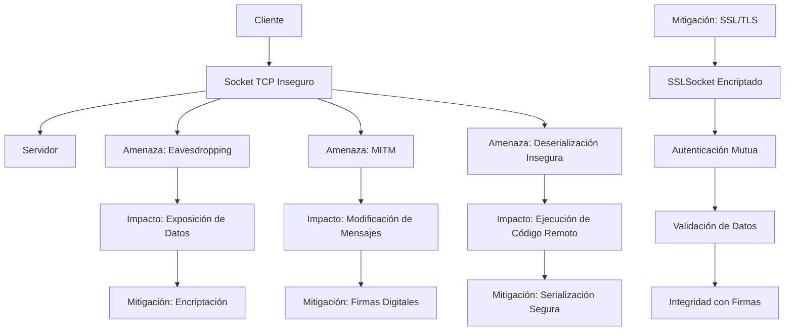

# Modelo de Seguridad del Sistema Uber Distribuido

## Identificación de Canales Inseguros

Basado en el análisis del código, los principales canales inseguros identificados son:

1. **Comunicación TCP sin encriptación**: El cliente y servidor utilizan `Socket` estándar sin SSL/TLS, lo que permite la interceptación de datos en tránsito.
2. **Serialización de objetos**: Uso de `ObjectInputStream` y `ObjectOutputStream` para enviar objetos `MensajeUber`, `SolicitudViaje`, etc., vulnerables a ataques de deserialización insegura.
3. **Falta de autenticación**: No hay verificación de identidad del cliente o servidor; solo se basa en el nombre de usuario proporcionado.
4. **Datos sensibles en claro**: Información como origen, destino, usuario y detalles del viaje se transmiten sin cifrado.

## Descripción de Amenazas (Ataques Posibles)

Las amenazas identificadas incluyen:

1. **Eavesdropping (Escucha pasiva)**: Un atacante puede capturar el tráfico de red y leer datos sensibles como solicitudes de viaje y respuestas del servidor.
2. **Man-in-the-Middle (MITM)**: Interceptar y modificar mensajes en tránsito, por ejemplo, cambiar el destino de un viaje o falsificar respuestas.
3. **Deserialización insegura**: Enviar objetos serializados maliciosos que puedan ejecutar código arbitrario en el servidor o cliente (e.g., gadget chains).
4. **Spoofing de identidad**: Falsificar ser el servidor para engañar al cliente o viceversa, ya que no hay autenticación mutua.
5. **Denegación de Servicio (DoS)**: Enviar múltiples conexiones o mensajes grandes para sobrecargar el servidor o cliente.
6. **Modificación de datos**: Alterar el estado de viajes o solicitudes durante la transmisión.

## Propuestas de Mitigación Técnicas en Java

Para mitigar estas amenazas, se proponen las siguientes técnicas implementables en Java:

1. **Encriptación con SSL/TLS**:
   - Reemplazar `Socket` con `SSLSocket` para cifrar la comunicación.
   - Configurar certificados X.509 para autenticación mutua.
   - Código ejemplo: Usar `SSLContext` y `KeyManagerFactory` para inicializar sockets seguros.

2. **Autenticación y Autorización**:
   - Implementar autenticación basada en tokens o certificados.
   - Usar `KeyStore` para gestionar certificados de cliente/servidor.
   - Verificar identidad antes de procesar solicitudes.

3. **Validación de Datos y Serialización Segura**:
   - Evitar deserialización directa; usar formatos seguros como JSON con validación.
   - Implementar listas blancas de clases permitidas para deserialización.
   - Usar bibliotecas como Jackson para serialización JSON en lugar de Object Streams.

4. **Integridad de Mensajes**:
   - Firmar mensajes con `Signature` y `PrivateKey` para detectar modificaciones.
   - Verificar firmas en el receptor usando `PublicKey`.

5. **Protección contra DoS**:
   - Implementar rate limiting en el servidor (e.g., usando `RateLimiter` de Guava).
   - Limitar el tamaño de mensajes y número de conexiones por IP.

6. **Mejores Prácticas Generales**:
   - Usar timeouts en sockets para prevenir bloqueos.
   - Registrar logs de seguridad para auditoría.
   - Actualizar dependencias para parches de seguridad.

## Diagrama de Modelo de Seguridad

## Descripción del Diagrama

- **Flujo Normal**: Cliente se conecta al servidor via socket TCP.
- **Amenazas**: Representadas como ramas que divergen del canal inseguro, mostrando posibles ataques.
- **Mitigaciones**: Cadena de mejoras de seguridad que transforman el canal inseguro en uno seguro.
- **Impactos**: Consecuencias de las amenazas, con flechas a las mitigaciones correspondientes.

Este modelo proporciona una visión integral de la seguridad del sistema, identificando vulnerabilidades y proponiendo soluciones técnicas específicas para Java.